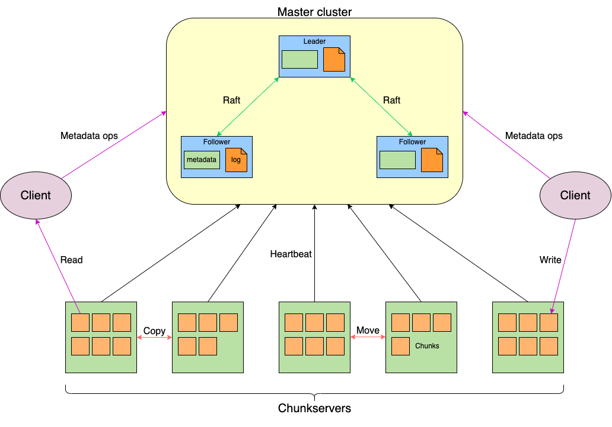
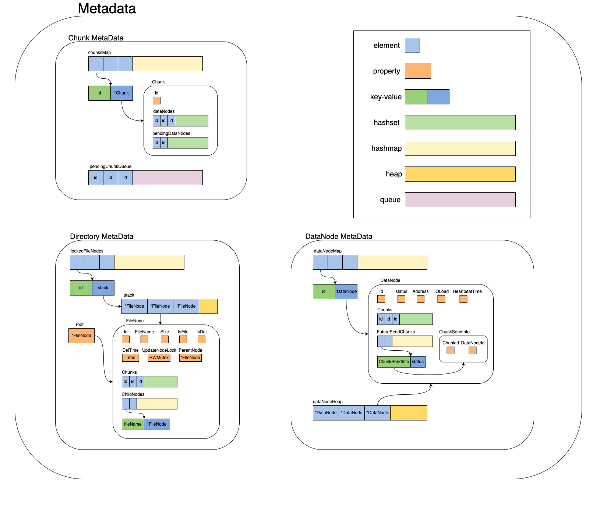
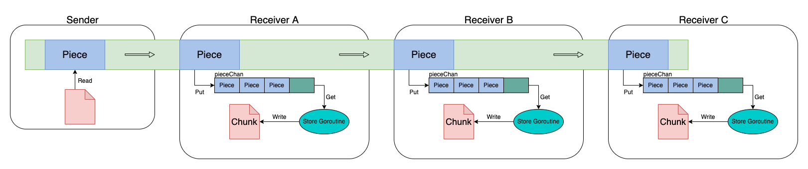
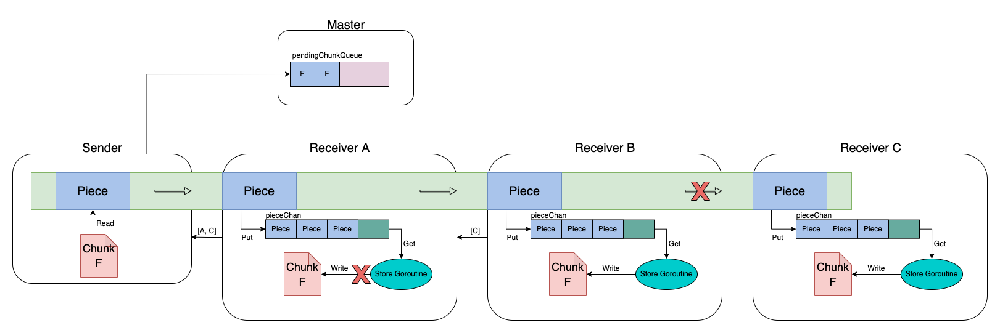
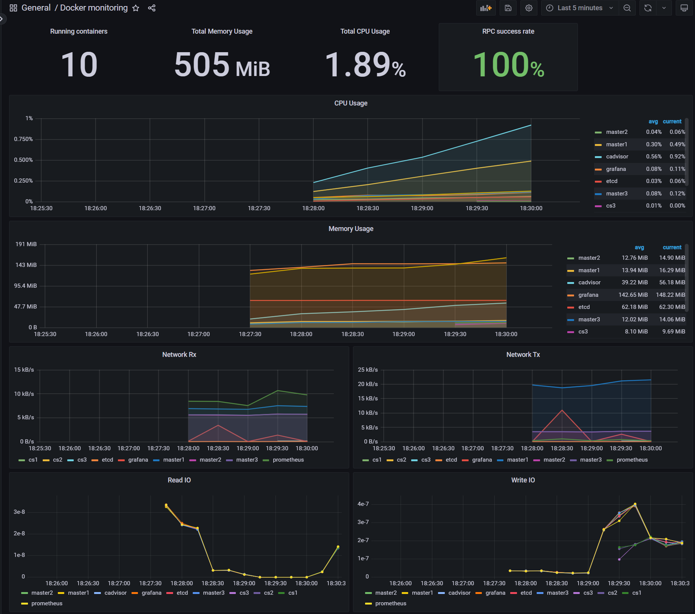

# CatDFS

[ English ](README.md)

CatDFS是一个使用Golang实现轻量级的开源分布式文件系统。
它参考了[《The Google File System》](https://static.googleusercontent.com/media/research.google.com/zh-CN//archive/gfs-sosp2003.pdf)
以及[HDFS](https://github.com/apache/hadoop)的设计并进行了改进和取舍。



此项目包含四个子项目：
* [master](https://github.com/zzhtttsss/tinydfs-master):master项目，系统的逻辑中心，负责管理chunkserver和元数据，类似于HDFS中的NameNode。
* [chunkserver](https://github.com/zzhtttsss/tinydfs-chunkserver):chunkserver项目，系统的存储节点。负责存储文件，类似于HDFS中的DataNode。
* [client](https://github.com/zzhtttsss/tinydfs-client):客户端项目，用户通过它于文件系统进行交互。
* [base](https://github.com/zzhtttsss/tinydfs-base):基石项目，包含各个子项目通用的方法，常量以及protocol部分，各个子项目均依赖于它。


作为一个分布式文件系统，CatDFS主要具备以下特点：
- 文件操作——上传文件(add)，下载文件(get)，移动文件(move)，删除文件(remove)，获取文件信息(stat)，打印目录(list)，重命名(rename)，未来还将会支持追加写入(append)。
- 高可靠性——文件以多副本的放置策略存储于不同的chunkserver中，副本数可以作为参数调整。
- 高可用性——存储元数据的master多节点部署，并采用raft分布式共识算法保证元数据一致性。只要master节点可用数量超过一半，系统就仍能正常运作，不存在单点故障。
- 缩容管理——当chunkserver故障时，系统会执行缩容操作，将数据节点上存储的文件根据策略转移至其他chunkserver上，确保不会丢失副本。
- 扩容管理——用户可以随时新增chunkserver，系统会根据策略将其他chunkserver上的文件转移过来。
- 负载均衡——在用户上传文件，系统缩容和扩容时，系统会寻找最优策略选取恰当的chunkserver放置文件，使各个chunkserver的磁盘使用量基本均衡。
- 崩溃恢复——master节点和chunkserver节点崩溃后重启都可以无需配置直接加入系统，其上存储的信息也都不会丢失。
- 系统监控——采用`Cadvisor`+`Prometheus`+`Grafana`对系统的各项运行指标和负载状况进行可视化监控。

作为一个适合新人入门的项目，CatDFS主要具备以下特点：
- 完备的功能特性——实现了一个分布式文件系统所需要的大部分功能和特性，有助于了解和学习分布式系统及相关依赖组件。
- 简单的系统架构——采用尽可能简洁的结构构建系统，尽可能做减法而不是做加法。
- 清晰的设计思路——提供完整的设计文档，包含了各个元数据和机制的设计，便于快速掌握系统的设计原理。
- 详细的代码注释——绝大多数函数和属性都有较为详尽的英文注释，帮助理解各个函数和变量的作用。

<!-- TOC -->
* [CatDFS](#catdfs)
  * [背景](#背景)
  * [安装](#安装)
  * [示例](#示例)
  * [设计](#设计)
    * [整体架构](#整体架构)
      * [Master](#master)
      * [Chunkserver](#chunkserver)
      * [Client](#client)
    * [元数据](#元数据)
      * [Chunk元数据](#Chunk元数据)
      * [DataNode元数据](#DataNode元数据)
      * [文件树](#文件树)
    * [高可用性](#高可用性)
      * [Leader切换](#Leader切换)
      * [元数据持久化](#元数据持久化)
      * [崩溃恢复](#崩溃恢复)
      * [读写分离](#读写分离)
    * [文件传输](#文件传输)
      * [采用GRPC Stream传输](#grpc-stream)
      * [接受转发和IO分离](#接受转发和IO分离)
      * [递归完成数据传输](#递归完成数据传输)
      * [错误处理](#错误处理)
    * [缩容](#缩容)
    * [扩容](#扩容)
    * [监控](#监控)
  * [维护者](#维护者)
  * [使用许可](#使用许可)
<!-- TOC -->

## 背景

CatDFS主要由两个硕士(同时也是菜鸟软件工程师)[@zzhtttsss](https://github.com/zzhtttsss)和[@DividedMoon](https://github.com/dividedmoon)
从零开始独立设计并实现。我们的目的主要是锻炼自己独立设计和编写项目的能力，并熟悉分布式系统，Raft算法和各个依赖组件。
这是我们首次在Github上发布独立实现的项目，因为我们也是初学者，在开发过程中，遇到问题的解决方式有限， 甚至是一边学习一边解决，
所以不足之处还望谅解。欢迎大家对CatDFS提出各种建议和问题，我们很希望这个项目能帮助新人学习相关知识，接下来我们也将会持续改进维护CatDFS～

这个项目使用 `Golang` 开发，为了模拟分布式环境，使用 `Docker` 进行测试。在`Docker compose`中，我们部署了`3`个`master`、
`5`个`chunkserver`，`Ectd`作为服务注册和发现的组件，`Cadvisor`+`Prometheus`+`Grafana`作为可视化监控的组件。

## 安装

1. 将各个模块编译为`docker`镜像，在各个模块的目录下：

```bash
docker build -t [name] .
```

2. 运行`docker compose`文件：
```bash
docker compose -f [compose.yaml] up -d
```

## 示例


## 设计

### 整体架构

CatDFS主要由三部分组成，Master，Chunkserver和Client。各个部分之间均采用GRPC进行通信。

#### Master

Master是整个系统的中枢节点，负责维护系统的元数据（主要包括Chunk信息，chunkserver信息和文件树）。为了保证高可用性，
Master采取多节点部署策略，并使用Raft共识算法（通过[hashicorp/raft](https://github.com/hashicorp/raft)实现）
保证Master多节点间的元数据一致性，并采用[hashicorp/raft](https://github.com/hashicorp/raft)自带
的日志持久化方式来完成元数据持久化。所有Master节点都会将自己的地址添加到Etcd中以确保Client和Chunkserver可以找到
它们。Master不会主动向Chunkserver发送命令，而是在接受Chunkserver的心跳时与Chunkserver同步信息，刷新元数据以及
分配文件发送任务。Master还会接受Client的请求，根据用户请求查找或是修改元数据。

#### Chunkserver

Chunkserver是系统的存储节点，负责实际存储用户上传的文件。但是Chunkserver上存储的不是整个的文件而是固定大小（64MB）的Chunk，
每个文件都会被切成等大的Chunk，每个Chunk按照用户设定的副本数量存在多个Chunkserver中。Chunkserver会定期向Master发送心跳，
并通过心跳与Master交换信息。Chunkserver与其他Chunkserver和Client之间会通过建立管道传输Chunk和接受Chunk。


#### Client

Client是供用户使用的客户端，用户通过客户端向系统发送各个指令。具体而言，Client会向Master请求获取或修改元数据，
与Chunkserver建立管道传输和接受Chunk。


### 元数据

CatDFS的元数据主要可分为三部分：Chunk元数据，DataNode（即Chunkserver）元数据和文件树。

#### Chunk元数据

Chunk元数据中主要包括chunksMap和pendingChunkQueue。chunksMap包含了当前系统中储存的所有Chunk以实现对Chunk O(1)的查找。
每个Chunk中会使用两个set分别存有当前已经存储该Chunk的DataNode（dataNodes），和已经分配了存储该Chunk但尚未确认储存完成的DataNode（pendingDataNodes）。
pendingChunkQueue是一个线程安全的队列，其中存有当前所有缺少副本等待系统分配的Chunk，每个Chunk在队列中出现一个即代表这个Chunk当前缺少一个副本。

#### DataNode元数据

DataNode元数据中主要包括dataNodeMap和dataNodeHeap。dataNodeMap包含了当前系统中所有尚未死亡的DataNode
（也就是Chunkserver）以实现对DataNode O(1)的查找。每个DataNode会用一个set记录该DataNode存有的Chunk（Chunks），
用一个map记录所有尚未确认完成的Chunk发送任务（FutureSendChunks）。

#### 文件树

文件树采用前缀树（Trie）结构，每一个节点代表一个目录或文件，每个节点会存储自己的父亲节点和儿子节点（通过map）。
每次查找都会根据文件名沿树查找，平均时间复杂度为O(1)。



### 高可用性

CatDFS的Master节点高可用性主要采用由Raft共识算法保证元数据一致性的Master多节点方案
（基于[hashicorp/raft](https://github.com/hashicorp/raft)实现），并借助Etcd来进行服务注册和发现。

#### Leader切换

当Leader节点崩溃或是出现网络故障一定时间没有和集群其他节点保持联系后，Master集群会重新选举出的Leader节点并进行Leader切换。

新Leader节点将会：
* 将自身的地址写入到Etcd相应的key中来替换原Leader节点的地址；
* 注册一个Observer监控Follower节点状态变化事件，以便在Follower节点死亡后及时将其移出集群；
* 在一个协程中监控Chunkserver心跳；
* 在一个协程中定时消费pendingChunkQueue；
* 在一个协程中定时清理元数据垃圾，延时删除目录树节点。

旧Leader节点将会：
* 注销监控Follower节点状态变化事件的Observer；
* 取消所有的监控和定时协程；
* 将自身的地址写入到Etcd的Follower目录下。


#### 元数据持久化

CatDFS的元数据持久化利用了[hashicorp/raft](https://github.com/hashicorp/raft)的持久化机制。

具体而言，每个Master节点都会存储当前所有的日志信息（Log），集群信息并定期保存快照（Snapshot）。其中Log中包含对元数据的更改，
集群信息包含当前集群的节点状态，Snapshot包含所有的元数据信息。

#### 崩溃恢复

在一个Master节点崩溃后，其会被Leader节点从Raft集群和Etcd中删除。如果该节点是Leader节点，则会选举出新的Leader节点完成以上操作。

当Master节点恢复重启后，它将先读取Snapshot然后重新执行该Snapshot后的每一条Log信息来还原元数据。
之后它将重新加入Raft集群并在Etcd中重新注册它的信息，并从Leader节点获取到Log信息来将元数据变为最新状态。
完成以上步骤，Master节点即可重新对外提供服务。

#### 读写分离

读写分离即从Leader节点写元数据，从Follower节点读取元数据。对于读取元数据的操作，如List和Stat，我们提供了两种模式，
一种是从Leader节点读取元数据（Latest），这种模式可以保证读到的是最新数据；另一种是从Follower节点随机选取一个节点读取元数据（Stale），
这种模式下元数据存在50ms左右的延迟。用户可以在命令中添加参数来设置该命令采用哪种模式。

### 文件传输

文件传输主要采用管道（Pipeline）机制，该机制会将Client和多个Chunkserver之间建立管道，数据会从一端发送到管道上的每一个节点。

#### 采用GRPC Stream传输

因为一个Chunk大小为64mb，GRPC常规传输不适合这种大文件，所以采用这种流式传输，其会将整个chunk分为多次传输，这里称每次传输的为一个piece。

#### 接受转发和IO分离

因为IO非常缓慢，主线程进行频繁的IO会很影响pipline的传输效率，所以采用协程加管道的方式使得Chunkserver在协程中将接收到的piece写入到硬盘中，
而主线程只负责接收piece，放入管道传给协程以及将piece转发给下一个Chunkserver

#### 递归完成数据传输

当一个Chunkserver A被client或其他Chunkserver通过rpc调用transferChunk方法时，其会从Stream传递来的metadata中得到当前剩下的需要传输
的Chunkserver的切片，并取第一个Chunkserver B通过rpc调用B的transferChunk方法得到一个传输连接。

假设当前有client需要向Chunkserver A和Chunkserver B，Chunkserver C传输一个Chunk，这种设计可以使client在通过rpc调用A的transferChunk
方法建立一个stream连接来传输chunk时，A会同样通过调用B的transferChunk方法建立一个Stream连接，B会同样通过调用C的
transferChunk方法建立一个Stream连接，这样整个pipline就建立起来了，在client向A传输一个piece时，A会立即使用持有的
B的stream连接将piece转发给B，B收到后同理转发给C。



#### 错误处理

一个管道中的每一个Chunkserver都可能出现两种错误：文件写入错误或是数据传输错误。文件写入错误只会影响到单个节点,
而数据传输错误会影响到发生错误的节点及其后续的所有节点。

为了得到所有存储Chunk失败的节点来让Master在之后能弥补缺失的副本，每个Chunkserver在传输完成后都会返回一个错误列表给管道中的前一个节点。
该列表包含该节点及该节点之后所有节点中传输失败的节点地址，该列表的维护机制如下：
* 当节点发生文件写入错误时，便将自己的地址加入到列表中；
* 当节点向下一个节点发送数据出错时，将该节点之后的所有节点地址都加入到列表中；
* 当节点接收数据出错时，直接停止接收和发送数据；
* 节点在接收到下一个节点返回的错误列表后，会将当前自己的列表与该列表合并。

通过该机制，管道的第一个节点也就是发送方能够获取到管道中所有存储Chunk失败的节点并统计数量将其返回给Master。

Master会将向pendingChunkQueue中加入此数量的该Chunk，并在之后通过消费pendingChunkQueue来补齐该Chunk的副本。



### 缩容

Master在一定时间没有收到某个Chunkserver的心跳后会判定该Chunkserver死亡，触发缩容。

Chunkserver死亡的判定条件：
1. 由leader发起MonitorHeartbeat协程，每隔一段时间检查各个Chunkserver的心跳时间。当某个Chunkserver心跳时间超过[30s]未刷新时，
认为该Chunkserver进入Died状态，此时不接受leader发起的任何安排;
2. 再经过[10m]，如果该Chunkserver还未成功刷新状态(成功发起心跳)，则视为该Chunkserver彻底下线，
于是将该Chunkserver注销，其上存储的Chunk需要进行复制以确保副本数。

Chunkserver确定死亡后，由leader将该Chunkserver上包含的所有Chunk以及特殊列表中还存在的Chunk存放进一个特殊队列(pendingChunkQueue)中。
所有需要复制的Chunk都需要放到该队列，无论是否是由于缩容导致的。

由leader发起MonitorDeadChunk协程，每隔一段时间或发现该Queue的Chunk数量超过阈值时，开始进行复制操作：
1. 为了避免频繁发起日志Apply操作，这里进行批处理，批的数量为[32=2G]。对于一批中的各个Chunk，需要寻找存储该Chunk且存活的Chunkserver
以及将该Chunk复制过去且存活的Chunkserver;
2. 如何寻找存储该Chunk的Chunkserver？每个Chunk结构会记录存储的Chunkserver，从中获取存活的且IO量较小的Chunkserver即可；
3. 如果寻找将该Chunk复制过去Chunkserver？通过DFS查找目的Chunkserver的最优解；
4. 寻找完毕后，还需要进行2步操作：
   1. 汇总复制的转移记录，形成Operation，并实现Apply方法。(因为是对元数据进行修改)
   2. 为了避免Leader调用Chunkserver的RPC，将转移的Chunk和目的地一并放进对应Chunkserver的特殊列表FutureSendChunks中，
并随着心跳机制传给Chunkserver。在Chunkserver接收到心跳后，对该Chunk和目的地发起RPC进行复制。

具体流程如图所示（图片较大以至于Github不能很好的显示，
建议下载查看）：


### 扩容

扩容处理应该在新增Chunkserver节点时触发，而不是Chunkserver重新上线时触发。

触发条件：
- Chunkserver进行注册时，会扫描存储在该Chunkserver上的所有Chunk。如果不为空，说明是重新上线；如果为空，说明是新增节点。
- 设 a = 注册的Chunkserver节点上存储的Chunk数量(新增节点则为0)；b = Leader上所有Chunkserver存储的Chunk数量的平均值
- a >= b  不扩容
- a < b && b - a <= 1 不扩容
- b - a > 2 扩容

扩容策略：
1. 确定分配的Chunk数量，即其他Chunk数量的平均值；
2. 检查该Chunkserver自带的Chunk，为其分配的Chunk不应该出现在这里；
3. 检查每个存活Chunkserver的Chunk列表，每次从中取一个不在待处理列表和自带Chunk列表的Chunk。直到不能取或数量到达上限为止；
4. 待处理列表会分别存储到对应的Chunkserver中，并跟随心跳反馈给Chunkserver。

需要进行扩容操作的Chunkserver在操作还未完成时，是无法正常参与Master调度，直到通过心跳获取到大部分的分配Chunk已经成功移动到本地。

具体流程如图所示：


### 监控

使用`Cadvisor`+`Prometheus`+`Grafana`作为可视化监控的组件。监控内容包括：
* 运行的容器数量
* 各个容器的CPU使用率
* 各个容器的内容使用率
* 网络IO
* 磁盘IO
* 各个RPC调用的数量和成功率



## 维护者

[@zzhtttsss](https://github.com/zzhtttsss)

[@DividedMoon](https://github.com/dividedmoon)

## 使用许可

[GPL](LICENSE)
